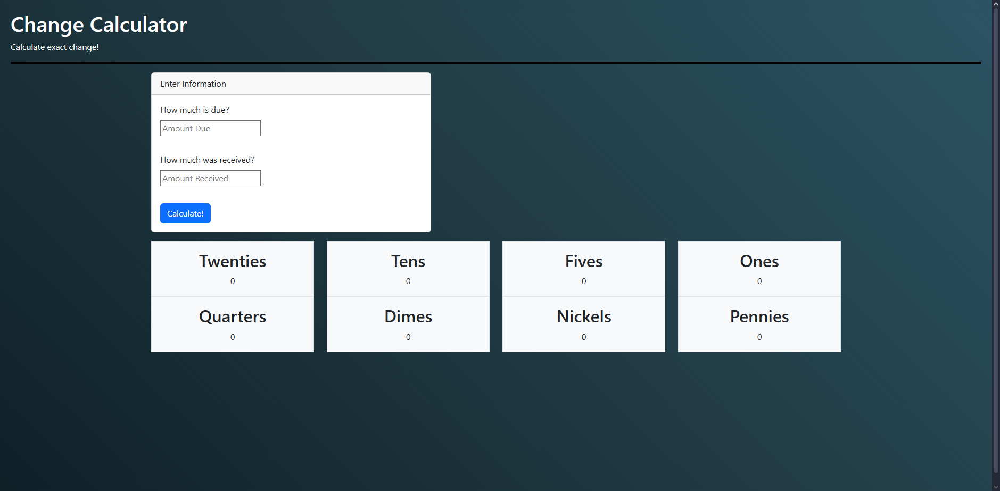

# Change Calculator Project

Change Calculator is an application that finds the exact change of dollars and cents after inputting a cost value and a payment value.

## Features
- Automatically calculates the required amount of change
- Filters change through separate dollar bills and cents

## Demo
**Live Site:** [react-js-change-calculator.vercel.app](https://react-js-change-calculator.vercel.app/)
**GitHub Repo:** [Evres-sys/ReactJS-Change-Calculator](https://github.com/Evres-sys/ReactJS-Change-Calculator)

## Installation / Setup
1. Clone the repository:
    ```bash
    git clone https://github.com/Evres-sys/ReactJS-Change-Calculator.git
    ```
2. Navigate into the project folder:
    ```bash
    cd ReactJS-Change-Calculator
    ```
3. Install dependencies:
    ```bash
    npm install
    ```
4. Start the development server:
    ```bash
    npm start
    ```

## Tech Stack
- **Frontend:** React, Bootstrap
- **Deployment:** Vercel

## Screenshots


## License
This project is licensed under the [MIT License](./LICENSE).

